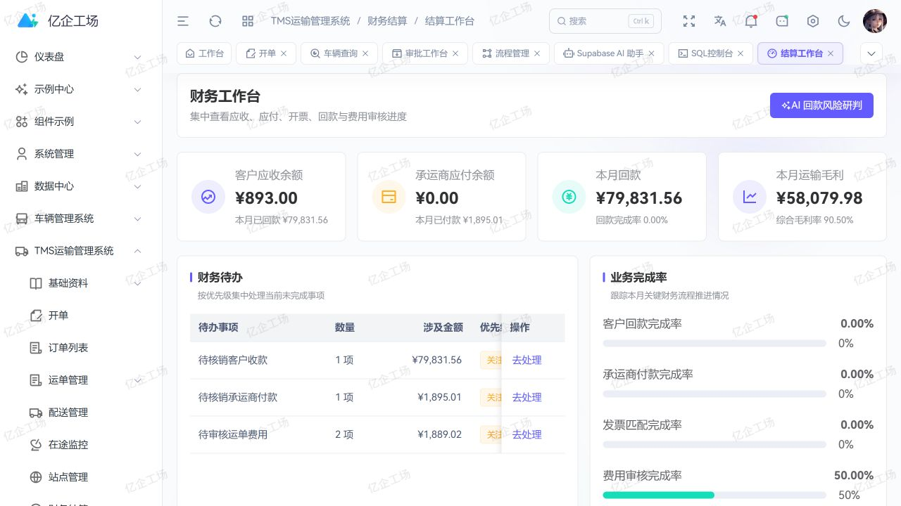

<div align="center">
  <h1>亿企工场 FMS</h1>
  <p><strong>面向运输与企业经营的一体化财务管理应用</strong></p>
  <p>把业务结算、资金收付、会计核算、票税资产与经营分析连接成可追溯的财务闭环。</p>

  <p>
    <a href="https://gitee.com/wangyanghub/art-supabase-fms">Gitee</a>
    ·
    <a href="https://github.com/869123771/art-supabase-fms">GitHub</a>
    ·
    <a href="https://gitee.com/wangyanghub/art-supabase-pro">主平台</a>
    ·
    <a href="https://869123771.github.io/art-supabase-doc/modules/fms">使用文档</a>
  </p>
</div>

## 项目定位

亿企工场 FMS 是亿企工场的财务管理业务应用。它不是孤立的财务页面集合，而是以运输单据和企业经营活动为来源，覆盖结算、资金、核算、报表与高风险反向操作治理。

本仓只维护 FMS 页面、业务 API、领域类型与适配代码。登录、租户、菜单、权限、布局、路由、公共组件、Store 和 Supabase 公共客户端由 [`art-supabase-pro`](https://gitee.com/wangyanghub/art-supabase-pro) 统一提供。



## 核心能力

| 领域     | 已覆盖能力                                                                 |
| -------- | -------------------------------------------------------------------------- |
| 运输财务 | 客户/承运商对账、应收账龄、收付款、发票、运单费用、利润分析                |
| 资金管理 | 资金账户、资金日记账、账户调拨、现金预测、银行对账、付款申请               |
| 会计核算 | 账套与期间、科目、辅助核算、币种汇率、期初余额、凭证、自动入账、账簿与报表 |
| 专项财务 | 费用报销、商业票据、税务、固定资产、薪资、期末结账与异常中心               |
| 智能辅助 | 发票/票据 OCR、费用识别、合规复核、回款风险建议与核算准备检查              |

## 业务闭环

```text
运输与经营单据
  → 对账 / 应收应付 / 费用
  → 收付款 / 核销 / 发票
  → 凭证草稿 / 审核 / 过账
  → 账簿 / 报表 / 期末结账
  → 经营分析与异常治理
```

OCR 与 AI 只提供可复核的录入和分析建议；付款、过账、结账、反结账等高风险动作仍由有权限的人员确认，并由服务端权限与审计边界约束。

### 多账套自动入账约束

资产、折旧批次、薪资批次、税务期间和商业票据的入账事件继承来源记录的账套。服务端从对应业务表读取账套并验证租户一致性，不接受事件载荷指定的任意账套；缺失或跨租户来源必须拒绝。其他未明确归属账套的业务来源沿用租户默认账套规则。

2026-10-03 已通过正式重试接口验证两条资产转固和两个折旧批次：分别生成借贷平衡的两条分录，金额为 1200、2400、60、60。账套继承与跨租户拒绝经过事务回滚验证，内部解析函数仅授予数据库所有者执行权限。此记录仅证明该流程，不代表整个 FMS 的增删改查验收完成。

### 薪资流程验收记录

2026-10-03 使用业务账号在浏览器中为草稿验收批次新增两条员工明细，并编辑其中一条；批次自动重算为两名员工、实发合计 31。另一验收批次完成审批及发放，实发 280，资金日记账登记一笔同额支出。计提和支付事件分别生成借贷平衡的 355、280 两张凭证，两张凭证均已通过页面审核及过账；应付工资明细账包含支付借方 280、计提贷方 280，期末余额为 0。资金记录与薪资来源的租户、账套一致性检查无异常。

执行前已备份批次、明细、资金账户及关联记录，并通过回滚事务验证审批和发放。草稿批次通过引用检查后实际删除一条明细，并从新增页面恢复第二条明细。已验证桌面和窄屏详情展示、发放后明细锁定；全模块增删改查验收仍需逐项完成。

## 独立运行

环境要求：Node.js `>= 22.0.0`、pnpm `>= 11.9.0`。

```powershell
pnpm install
pnpm dev
```

默认访问 `http://localhost:3012`。独立运行时，FMS 菜单提升为一级入口；由主平台装载时仍保留 FMS 应用分组。

```powershell
pnpm check
pnpm build
pnpm preview
```

生产构建输出到 `docs/`，默认公共路径为 `/art-supabase-fms/`，可作为 Pages 发布目录。

## 与主仓协作

FMS 业务修改在本仓提交并推送，随后在主仓更新 `modules/art-supabase-fms` 子模块指针。跨模块读取使用用途明确、字段最小化、租户隔离的 API/RPC 契约；FMS 不直接导入其他业务仓源码，也不复制主平台公共运行时。

## 安全原则

- 页面可见和按钮可用不代表后端授权，数据库 RLS 与服务端校验是最终边界。
- 制单、审核、过账、付款、核销、结账及反向操作应拆分权限并保留审计。
- 前端只使用 Supabase `anon` / publishable key，不暴露 `service_role` 或第三方服务密钥。

## 许可证

本项目采用 [MulanPSL-2.0](LICENSE) 许可证。
